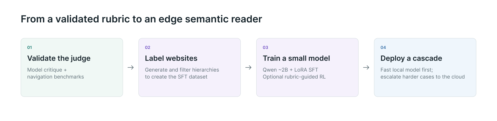

# Semantic Reader Model

Local interface understanding for an edge–cloud semantic reader.

The goal is to turn a website's DOM or accessibility tree into a navigable semantic hierarchy: broad groups for orientation, more detail when needed, and links back to the original content and controls. A small local model should handle routine processing; an eventual routing policy can request help from a larger model with selected context.

## Where the project stands

- **Implemented:** a local hierarchy/DOM inspector, compact-input experiments, an Ollama transport, a rubric judge contract, a browser benchmark harness, and a resumable public-page capture/compression pipeline with a paused 100-candidate pilot.
- **Tested:** a twenty-episode pilot across two tasks, five representation conditions, and two navigator models. Seventeen official successes, two failures, and one unavailable verdict after the decision budget; all twenty episodes have complete annotations. Four concurrent workers passed the operational test.
- **Planned:** judge calibration across a broader corpus, a filtered SFT dataset, LoRA fine-tuning of a small Qwen model, optional rubric-guided reinforcement learning, and an adaptive edge–cloud cascade. No trained adapter or validated privacy router is claimed here.

The rubric is provisional. The pilot found both useful navigation patterns and incorrect judge interpretations. Model agreement is not a gold standard or evidence of benefit to screen-reader users.



## Published demo

[Open the inspector demo](https://www.dylanwootton.com/semantic-reader-model/). It opens the reviewed Allrecipes example and runs entirely as a static page; its original and revised hierarchies are authored research examples, not fine-tuned-model outputs. The Example menu also offers the three [SFT-109 held-out test cases](examples/sft109-cases/README.md), where the fine-tuned adapter's actual output sits beside the silver teacher outline and an authored gold candidate.

The Pages workflow publishes only the explicit reviewed artifact (six static inspector files, four sanitized datasets with their images, and a generated catalog); it does not publish the repository, model runner, local credentials, or other captures. See [the banana bread provenance](examples/banana-bread/README.md) and [the SFT-109 case provenance](examples/sft109-cases/README.md).

## Try the local inspector

Use Python 3.12+ and a current Node.js runtime. The demo and inspector need no Python packages, model credentials, or cloud access.

```sh
python3 scripts/prepare_demo.py
python3 inspector/serve.py --port 8765
```

Open <http://127.0.0.1:8765/>. The demo uses synthetic library content. It supports navigating the hierarchy and its source tree without executing a captured website's scripts. Demo preparation preserves any existing local capture catalog.

The raw research captures are deliberately **not included**. One separately reviewed, sanitized banana bread view is included for the explicitly requested public demo. They contain third-party page content and may contain session-specific or credential-like material. Other capture-derived exports, screenshots, request logs, and benchmark runs stay local. Scripts that require that corpus are included as research tools, not as prepopulated demos.

## Project map

| Directory | Purpose |
|---|---|
| `harness/` | Browser task runner, incremental reader, hierarchy generation, trajectory annotation, model clients, and shared concurrency budget |
| `collection/` | Permission/robots-aware DOM and screenshot capture, audited compression, resumable queue, and a pilot paused awaiting the semantic prompt; see [collection notes](collection/README.md) |
| `inspector/` | Local browser UI, hierarchy comparison, structural metrics, and model experiments |
| `evals/hierarchy_judge/` | Rubric prompt, JSON schemas, mechanical validation, and synthetic adversarial fixtures |
| `experiments/` | DOM compaction/recovery and local regional inference probes |
| `examples/demo/` | Small synthetic inspector example safe to share |
| `docs/research/` | Design notes, evidence, provisional rubric, and pilot findings |
| `docs/results/` | Aggregate pilot counters, without raw observations or model request logs |
| `infra/` | Optional lab VM/bootstrap helpers; see [setup notes](infra/SETUP.md) |
| `tests/` | Harness and model-client regression tests |

Start with the [project vocabulary](CONTEXT.md), [pilot findings](docs/research/pilot-final-results.md), and [judge documentation](evals/hierarchy_judge/README.md). Earlier research notes describe the state when written; this README records the current publication status. Evidence paths into `runs/` and original `examples/` refer to local-only artifacts.

## Development checks

The harness's offline unit tests use the standard library. Judge schema validation additionally uses `jsonschema`; the browser benchmark uses the pinned optional environment in `infra/benchmark-requirements.txt`.

```sh
python3 -m unittest discover -s tests -q
python3 -m unittest discover -s inspector -p 'test_*.py' -q
python3 -m unittest discover -s evals/hierarchy_judge -p 'test_*.py' -q
node --test inspector/*.test.mjs
python3 scripts/check_staged_files.py
```

Install `jsonschema` in your chosen development environment to run the judge contract suite. Tests requiring the original fourteen-site capture corpus are optional and are reported as skipped in a clean checkout; use `SEMANTIC_LOCAL_CORPUS_TESTS=1` only when those artifacts are available. Live browser integrations require the separately installed benchmark environment and `SEMANTIC_BROWSER_INTEGRATION=1`. These commands do not launch paid model runs.

## Credentials and publication

Keep actual account configuration in ignored `.lab-config.json`, based on [.lab-config.example.json](.lab-config.example.json). The cloud transport verifies the configured user and project, pins CLI calls, and does not fall back to application-default credentials or impersonation. Credential envelopes are created outside the repository. Optional cloud commands require an explicitly configured account and may incur costs; see [infra setup](infra/SETUP.md).

Before a commit, `scripts/check_staged_files.py` checks the exact staged bytes for common credential patterns and rejects local-only artifact paths. It reports locations and finding types without printing matched values. This is a guardrail, not proof that arbitrary new captures are safe to publish.

Enable the included local pre-commit check after cloning:

```sh
git config core.hooksPath .githooks
```
